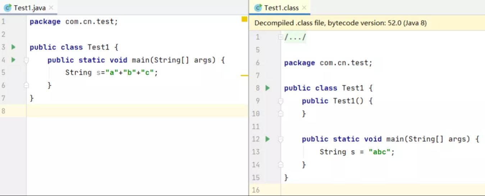
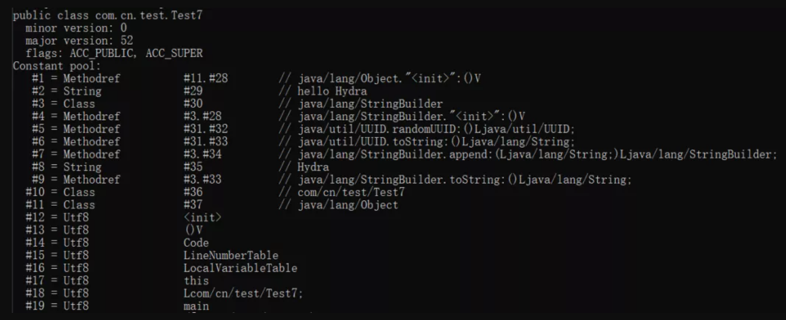
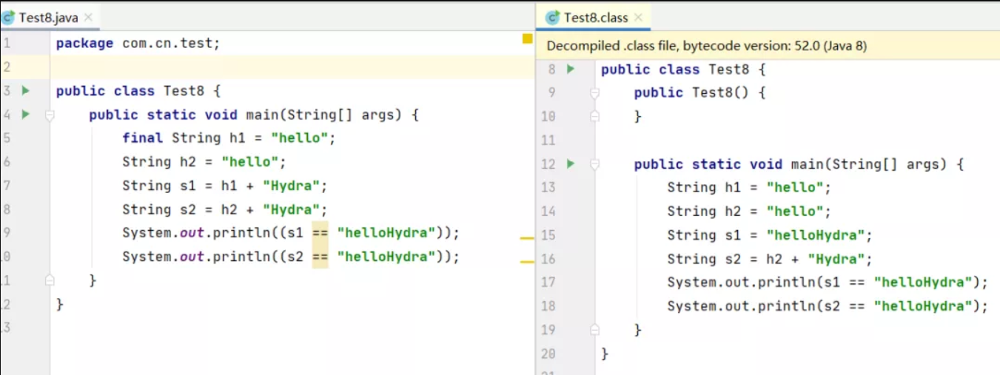
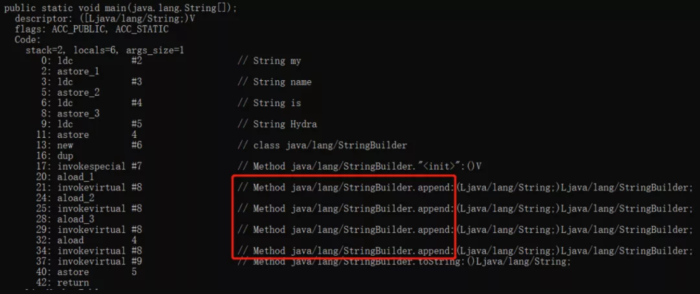

[常量折叠](#常量折叠)  
[编译期常量](#编译期常量)  

### 常量折叠

首先看一道常见的面试题，下面代码中，会创建几个字符串对象？
```java
String s = "a" + "b" + "c";
```
如果你比较一下Java源代码和反编译后的字节码文件，就可以直观地看到答案，只创建了一个String对象。
  
估计大家会有疑问了，为什么源代码中字符串拼接的操作，在编译完成后会消失，直接呈现为一个拼接后的完整字符串呢？

这是因为在编译期间，应用了编译器优化中一种被称为**常量折叠**(Constant Folding)的技术，会将**编译期常量**的加减乘除的运算过程在编译过程中折叠。  
编译器通过语法分析，会将常量表达式计算求值，并用求出的值来替换表达式，而不必等到运行期间再进行运算处理，从而在运行期间节省处理器资源。

### 编译期常量
而上边提到的编译期常量的特点就是它的值在编译期就可以确定，并且需要完整满足下面的要求，才可能是一个编译期常量：
- 被声明为final
- 基本类型或者字符串类型
- 声明时就已经初始化
- 使用常量表达式进行初始化

上面的前两条比较容易理解，需要注意的是第三和第四条，通过下面的例子进行说明：
```java
final String s1 = "hello " + "Hydra";
final String s2 = UUID.randomUUID().toString() + "Hydra";
```
编译器能够在编译期就得到s1的值是hello Hydra，不需要等到程序的运行期间，因此s1属于编译期常量。  
而对s2来说，虽然也被声明为final类型，并且在声明时就已经初始化，但使用的不是常量表达式，因此不属于编译期常量，这一类型的常量被称为运行时常量。  
再看一下编译后的字节码文件中的常量池区域：
  
可以看到常量池中只有一个String类型的常量hello Hydra，而s2对应的字符串常量则不在此区域。  
对编译器来说，运行时常量在编译期间无法进行折叠，编译器只会对尝试修改它的操作进行报错处理。

另外值得一提的是，编译期常量与运行时常量的另一个不同就是是否需要对类进行初始化，下面通过两个例子进行对比：
```java
public class IntTest1 {
    public static void main(String[] args) {
        System.out.println(a1.a);
    }
}
class a1{
    static {
        System.out.println("init class");
    }
    public static int a=1;
}
//输出：
//init class
//1
```
如果对上面进行修改，对变量a添加final进行修饰：
```java
public static final int a=1;
//输出：
//1
```
可以看到在添加了final修饰后，两次运行的结果是不同的，这是因为在添加final后，变量a成为了编译期常量，不会导致类的初始化。  
另外，在声明编译器常量时，final关键字是必要的，而static关键字是非必要的，上面加static修饰只是为了验证类是否被初始化过。

我们再看几个例子来加深对final关键字的理解，运行下面的代码：
```java
public static void main(String[] args) {
    final String h1 = "hello";
    String h2 = "hello";
    String s1 = h1 + "Hydra";
    String s2 = h2 + "Hydra";
    System.out.println((s1 == "helloHydra"));
    System.out.println((s2 == "helloHydra"));
}
//执行结果：
//true
//false
```
代码中字符串h1和h2都使用常量赋值，区别在于是否使用了final进行修饰，对比编译后的代码，s1进行了折叠而s2没有，可以印证上面的理论，final修饰的字符串变量属于编译期常量。
  
再看一段代码，执行下面的程序，结果会返回什么呢？
```java
public static void main(String[] args) {
    String h ="hello";
    final String h2 = h;
    String s = h2 + "Hydra";
    System.out.println(s=="helloHydra");
}
//答案是false，因为虽然这里字符串h2被final修饰，但是初始化时没有使用编译期常量，因此它也不是编译期常量。
```
在上面的一些例子中，在执行常量折叠的过程中都遵循了使用常量表达式进行初始化这一原则，这里可能有的同学还会有疑问，到底什么样才能算得上是常量表达式呢？  
在Oracle官网的文档中，列举了很多种情况，下面对常见的情况进行列举（除了下面这些之外官方文档上还列举了不少情况，如果有兴趣的话，可以自己查看）：
- 基本类型和String类型的字面量
- 基本类型和String类型的强制类型转换
- 使用+或-或!等一元运算符（不包括++和--）进行计算
- 使用加减运算符+、-，乘除运算符*、 / 、% 进行计算
- 使用移位运算符 >>、 <<、 >>>进行位移操作
- ……
字面量（literals）是用于表达源代码中一个固定值的表示法，在Java中创建一个对象时需要使用new关键字，但是给一个基本类型变量赋值时不需要使用new关键字，这种方式就可以被称为字面量。  
Java中字面量主要包括了以下类型的字面量：
```java
//整数型字面量：
long l=1L;
int i=1;

//浮点类型字面量：
float f=11.1f;
double d=11.1;

//字符和字符串类型字面量：
char c='h';
String s="Hydra";

//布尔类型字面量：
boolean b=true;
```
当我们在代码中定义并初始化一个字符串对象后，程序会在常量池(constant pool)中缓存该字符串的字面量，如果后面的代码再次用到这个字符串的字面量，会直接使用常量池中的字符串字面量。

除此之外，还有一类比较特殊的null类型字面量，这个类型的字面量只有一个就是null，这个字面量可以赋值给任意引用类型的变量，表示这个引用类型变量中保存的地址为空，也就是还没有指向任何有效的对象。

那么，如果不是使用的常量表达式进行初始化，在变量的初始化过程中引入了其他变量（且没有被final修饰）的话，编译器会怎样进行处理呢？我们下面再看一个例子：
```java
public static void main(String[] args) {
    String s1="a";
    String s2=s1+"b";
    String s3="a"+"b";
    System.out.println(s2=="ab");
    System.out.println(s3=="ab");
}
//
false
true
```
为什么会出现不同的结果？在Java中，String类型在使用==进行比较时，是判断的引用是否指向堆内存中的同一块地址，出现上面的结果那么说明指向的不是内存中的同一块地址。

通过之前的分析，我们知道s3会进行常量折叠，引用的是常量池中的ab，所以相等。而字符串s2在进行拼接时，表达式中引用了其他对象，不属于编译期常量，因此不能进行折叠。

那么，在没有常量折叠的情况下，为什么最后返回的是false呢？我们看一下这种情况下，编译器是如何实现，先执行下面的代码：
```java
public static void main(String[] args) {
    String s1="my ";
    String s2="name ";
    String s3="is ";
    String s4="Hydra";
    String s=s1+s2+s3+s4;
}
```
然后使用javap对字节码文件进行反编译，可以看到在这一过程中，编译器同样会进行优化：
  
可以看到，虽然我们在代码中没有显示的调用StringBuilder，但是在字符串拼接的场景下，Java编译器会自动进行优化，新建一个StringBuilder对象，然后调用append方法进行字符串的拼接。而在最后，调用了StringBuilder的toString方法，生成了一个新的字符串对象，而不是引用的常量池中的常量。这样，也就能解释为什么在上面的例子中，s2=="ab"会返回false了。

