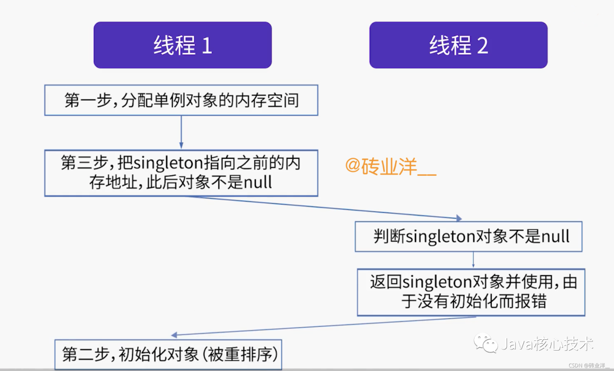

[双重校验锁单例(DCL)](#双重校验锁单例(DCL))  
[静态内部类单例](#静态内部类单例)  
[枚举单例](#枚举单例)


## 双重校验锁单例(DCL) ##
```java
public class Singleton {
    private static volatile Singleton singleton;

    private Singleton(){}
    
    public static Singleton getInstance(){
        if (singleton == null){
            synchronized (Singleton.class){
                if (singleton == null){
                    singleton = new Singleton();
                }
            }
        }
        return singleton;
    }
}
```
这种DCL写法的优点：不仅线程安全，而且延迟加载。

### 1.1 为什么要double check？去掉第二次check行不行？ ###
当然不行，当2个线程同时执行getInstance方法时，都会执行第一个if判断。由于锁机制的存在，会有一个线程先进入同步语句，而另一个线程等待。  
当第一个线程执行了new Singleton()之后，就会退出synchronized的保护区域。这时如果没有第二重if判断，那么第二个线程也会创建一个实例，这就破坏了单例。

### 1.2 singleton为什么要加上volatile关键字? ###
主要原因就是 singleton = new Singleton();不是一个原子操作。  
在JVM中，这句语句至少做了3件事：  
(1)给Singleton的实例分配内存空间；    
(2)调用Singleton()的构造函数，初始化成员字段；    
(3)将singleton指向分配的内存空间(此时singleton就不是null了)    

因为存在着指令重排序的优化，第2、3步的顺序是不能保证的，最后的执行顺序可能是1-2-3，也可能是1-3-2。  
假如执行顺序是1-3-2，我们看看会出现什么问题

虽然singleton不是null，但是指向的空间并没有初始化，还是会报错，这就是DCL失效的问题，这种问题难以跟踪难以重现可能会隐藏很久。

JDK1.5之前JMM(Java Memory Model，即Java内存模型)中的Cache、寄存器到主存的回写规定，上面第二第三的顺序无法保证。  
JDK1.5之后，SUN官方调整了JVM，具体化了volatile关键字，private static volatile Singleton singleton;只要加上volatile，就可以保证每次从主存中读取（这涉及到CPU缓存一致性问题，不在本文探讨范围内，有兴趣自行搜索），也可以防止指令重排序的发生，避免拿到未完成初始化的对象。

简单讲，volatile主要就是限制JIT编译器优化，编译器优化常用的方法有：  
(1)将内存变量缓存到寄存器；  
(2)调整指令顺序充分利用CPU指令流水线，常见的是重新排序读写指令。  
如果没有volatile关键字，则编译器可能优化读取，使用寄存器中的缓存值，如果这个变量由别的线程更新了的话，将出现实际值和读取的值不一致。  
使用了volatile后，编译器读取的时候跳过缓存，直接在内存中的实际位置读变量，写的时候通知其他缓存更新，这就是所谓的保证内存可见性，并且使用volatile还能禁止指令重排序。

## 静态内部类单例 ##
```java
public class Singleton {
    private Singleton{}
 
    private static class HolderClass{
        private static final Singleton instance = new Singleton();
    }
 
    public static Singleton getInstance(){
        return HolderClass.instance;
    }
}
```
与饿汉式的区别就在于，类加载的时候，这里并不会实例化对象，只有调用getInstance方法才会实例化对象。  
和DCL优点一样，延迟加载，效率高。  
虽然DCL和静态单例都不错，但是它们并不能防止反序列化和反射生成多个实例。

## 枚举单例 ##
其他所有的实现单例的方式其实是有问题的，那就是可能被反序列化和反射破坏。

我们来看看JDK1.5中添加的枚举类来实现单例
```java
public enum Singleton {
    INSTANCE;

    public void testMethod() {

    }
}
```
枚举的写法的优点：  
(1)不用考虑懒加载和线程安全的问题，代码写法简洁优雅  
(2)线程安全  
反编译任何一个枚举类会发现，枚举类里的各个枚举项是是通过static代码块来定义和初始化的(可以见后面3.2节反编译分析单例枚举有分析到这个)，它们会在类被加载时完成初始化，而java类的加载由JVM保证线程安全，所以，创建一个Enum类型的枚举是线程安全的

(3)防止破坏单例  
我们知道，序列化可以将一个单例的实例对象写到磁盘，然后再反序列化读回来，从而获得一个新的实例。即使构造函数是私有的，反序列化时依然可以通过特殊的途径去创建类的一个新的实例，相当于调用该类的构造函数。  
Java对枚举的序列化作了规定，在序列化时，仅将枚举对象的name属性输出到结果中，在反序列化时，就是通过java.lang.Enum的valueOf来根据名字查找对象，而不是新建一个新的对象。枚举在序列化和反序列化时，并不会调用构造方法，这就防止了反序列化导致的单例破坏的问题。  
对于反射破坏单例的而言，枚举类有同样的防御措施，反射在通过newInstance创建对象时，会检查这个类是否是枚举类，如果是，会抛出异常java.lang.IllegalArgumentException: Cannot reflectively create enum objects，表示反射创建对象失败。  
综上，枚举可以防止反序列化和反射破坏单例。

### 3.1 反编译分析单例枚举类 ###
为了让大家进一步了解枚举类，我们将上面枚举单例类进行反编译javap -p Singleton.class，其中-p的意思是反编译的时候要包含私有方法。
```java
// 这是反编译后的内容
public final class Singleton extends java.lang.Enum<Singleton> {
  public static final Singleton INSTANCE;
  private static final Singleton[] $VALUES;
  public static Singleton[] values();
  public static Singleton valueOf(java.lang.String);
  private Singleton();
  public void testMethod();
  static {
      // 省略
  };
}
```
我们可以看到，
- INSTANCE是Singleton类的实例
- Singleton继承了java.lang.Enum类
- 这里还有一个私有的Singleton的无参构造方法，枚举类的枚举项都会使用这个构造方法来实例化，也就是说，这里的INSTANCE会使用这个构造方法来实例化。
- 实例化的过程发生在最后空的static代码块中，可以通过javap的其他参数进一步分析static里面的字节码内容，static里面其实包含了很多字节码指令，这些指令在做枚举项INSTANCE的初始化工作，而static代码块是在类加载的时候执行的，也就是说Singleton类被加载的时候，INSTANCE就被初始化了。static代码块里面除了初始化INSTANCE，Singleton[] $VALUES这个定义的私有的数组也是在static里面创建和初始化的。然后把所有枚举项按照定义的顺序放入这个$VALUES数组中，最后我们可以通过values方法来访问这个数组