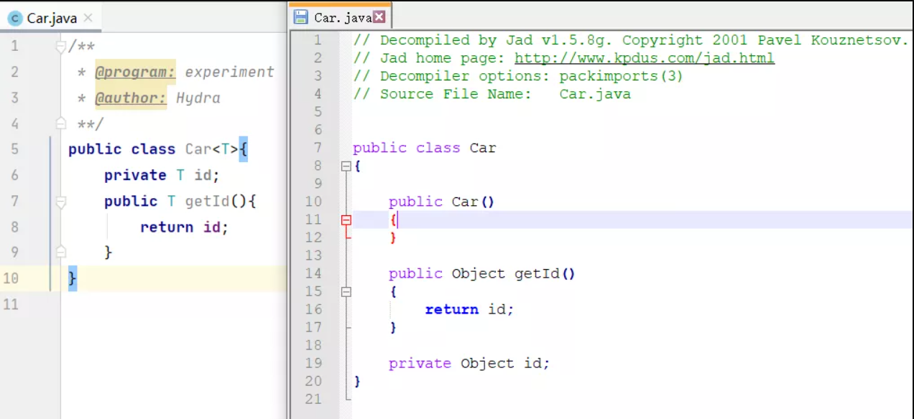
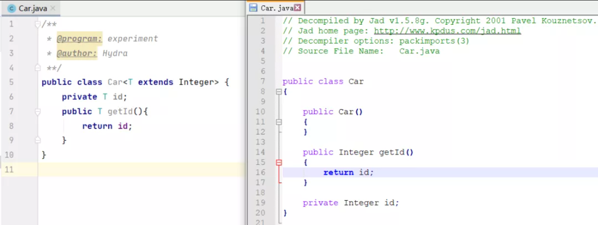
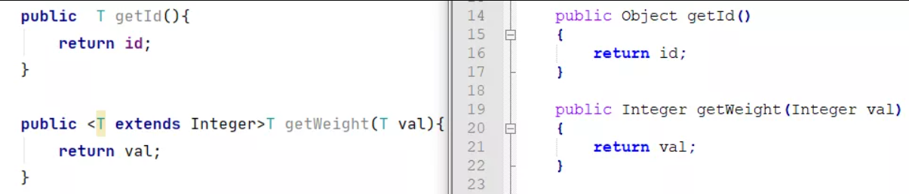
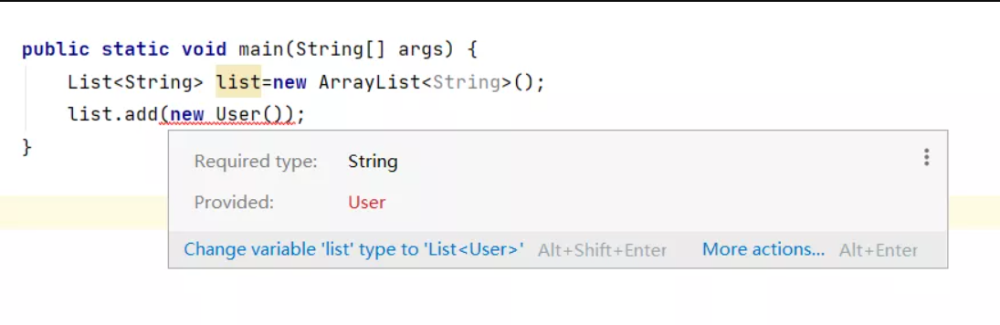
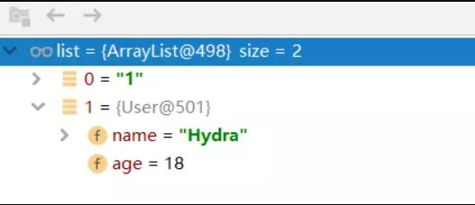
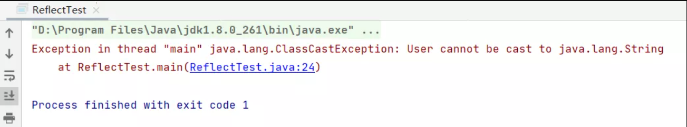
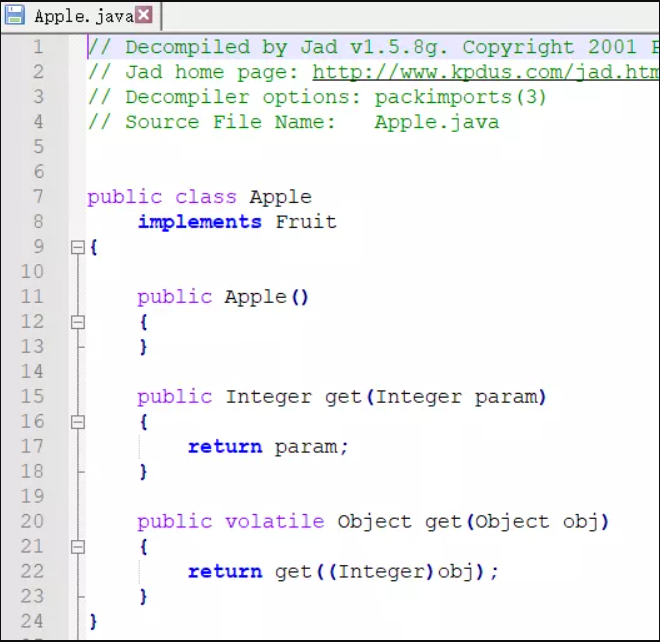

[类型擦除做了什么？](#类型擦除做了什么？)  
[反射能获取泛型的类型吗？](#反射能获取泛型的类型吗？)  
[类型擦除会引起什么问题？](#类型擦除会引起什么问题？)  

先看一道常见的面试题，下面的代码的执行结果是什么？
```java
public static void main(String[] args) {
    List<String> list1=new ArrayList<String>();
    List<Integer> list2=new ArrayList<Integer>();
    System.out.println(list1.getClass() == list2.getClass());
}
```
首先，我们知道getClas方法获取的是对象运行时的类(Class)，那么这个问题也就可以转化为ArrayList<String>和ArrayList<Integer>的对象在运行时对应的Class是否相同？

我们直接揭晓答案，运行上面的代码，程序会打印true。说明虽然在代码中声明了具体的泛型，但是两个List对象对应的Class是一样的，对它们的类型进行打印，结果都是：
```java
class java.util.ArrayList
```
也就是说，虽然ArrayList<String>和ArrayList<Integer>在编译时是不同的类型，但是在编译完成后都被编译器简化成了ArrayList，这一现象，被称为泛型的类型擦除(Type Erasure)。  
泛型的本质是参数化类型，而类型擦除使得类型参数只存在于编译期，在运行时，jvm是并不知道泛型的存在的。

那么为什么要进行泛型的类型擦除呢？  
查阅的一些资料中，解释说类型擦除的主要目的是避免过多的创建类而造成的运行时的过度消耗。  
试想一下，如果用List<A>表示一个类型，再用List<B>表示另一个类型，以此类推，无疑会引起类型的数量爆炸。

### 类型擦除做了什么？
上面我们说了，编译完成后会对泛型进行类型擦除，如果想要眼见为实，实际看一下的话应该怎么办呢？  
那么就需要对编译后的字节码文件进行反编译了，这里使用一个轻量级的小工具Jad来进行反编译（可以从这个地址进行下载：https://varaneckas.com/jad/）

Jad的使用也很简单，下载解压后，把需要反编译的字节码文件放在目录下，然后在命令行里执行下面的命令就可以在同目录下生成反编译后的.java文件了：
```shell script
jad -sjava Test.class
```
好了，工具准备好了，下面我们就看一下不同情况下的类型擦除。

**1.无限制类型擦除**  
当类定义中的类型参数没有任何限制时，在类型擦除后，会被直接替换为Object。  
在下面的例子中，<T>中的类型参数T就全被替换为了Object（左侧为编译前的代码，右侧为通过字节码文件反编译得到的代码）：
  
2、有限制类型擦除
当类定义中的类型参数存在限制时，在类型擦除中替换为类型参数的上界或者下界。下面的代码中，经过擦除后T被替换成了Integer：
  
3、擦除方法中的类型参数
比较下面两边的代码，可以看到在擦除方法中的类型参数时，和擦除类定义中的类型参数一致，无限制时直接擦除为Object，有限制时则会被擦除为上界或下界：
  

### 反射能获取泛型的类型吗？
估计对Java反射比较熟悉小伙伴要有疑问了，反射中的getTypeParameters方法可以获得类、数组、接口等实体的类型参数，如果类型被擦除了，那么能获取到什么呢？我们来尝试一下使用反射来获取类型参数：
```java
System.out.println(Arrays.asList(list1.getClass().getTypeParameters()));
//执行结果如下：
//[E]
```
同样，如果打印Map对象的参数类型：
```java
Map<String,Integer> map=new HashMap<>();
System.out.println(Arrays.asList(map.getClass().getTypeParameters()));
//执行结果如下：
//[K, V]
```
可以看到通过getTypeParameters方法只能获取到泛型的参数占位符，而不能获得代码中真正的泛型类型。

能在指定类型的List中放入其他类型的对象吗？
使用泛型的好处之一，就是在编译的时候能够检查类型安全，但是通过上面的例子，我们知道运行时是没有泛型约束的，那么是不是就意味着，在运行时可以把一个类型的对象能放进另一类型的List呢？  
我们先看看正常情况下，直接调用add方法会有什么报错：
  
当我们尝试将User类型的对象放入String类型的数组时，泛型的约束会在编译期间就进行报错，提示提供的User类型对象不适用于String类型数组。  
那么既然编译时不行，那么我们就在运行时写入，借助真正运行的class是没有泛型约束这一特性，使用反射在运行时写入：
```java
public class ReflectTest {
    static List<String> list = new ArrayList<>();

    public static void main(String[] args) {
        list.add("1");
        ReflectTest reflectTest =new ReflectTest();
        try {
            Field field = ReflectTest.class.getDeclaredField("list");
            field.setAccessible(true);
            List list=(List) field.get(reflectTest);
            list.add(new User());
        } catch (Exception e) {
            e.printStackTrace();
        }        
    }
}
```
执行上面的代码，不仅在编译期间可以通过语法检查，并且也可以正常地运行，我们使用debug来看一下数组中的内容：
  
可以看到虽然数组中声明的泛型类型是String，但是仍然成功的放入了User类型的对象。那么，如果我们在代码中尝试取出这个User对象，程序还能正常执行吗，我们在上面代码的最后再加上一句：
```java
System.out.println(list.get(1));
```
再次执行代码，程序运行到最后的打印语句时，报错如下：
  
异常提示User类型的对象无法被转换成String类型，这是否也就意味着，在取出对象时存在强制类型转换呢？我们来看一下ArrayList中get方法的源码：
```java
public E get(int index) {
    rangeCheck(index);
    return elementData(index);
}

E elementData(int index) {
    return (E) elementData[index];
}
```
可以看到，在取出元素时，会将这个元素强制类型转换成泛型中的类型，也就是说在上面的代码中，最后会尝试强制把User对象转换成String类型，在这一阶段程序会报错。通过这一过程，也再次证明了泛型可以对类型安全进行检测。

### 类型擦除会引起什么问题？
下面我们看一个稍微有点复杂的例子，首先声明一个接口，然后创建一个实现该接口的类：
```java
public interface Fruit<T> {
    T get(T param);
}

public class Apple implements Fruit<Integer> {
    @Override
    public Integer get(Integer param) {
        return param;
    }
}
```
按照之前我们的理解，在进行类型擦除后，应该是这样的：
```java
public interface Fruit {
    Object get(Object param);
}

public class Apple implements Fruit {
    @Override
    public Integer get(Integer param) {
        return param;
    }
}
```
但是，如果真是这样的话那么代码是无法运行的，因为虽然Apple类中也有一个get方法，但是与接口中的方法参数不一致，也就是说没有覆盖接口中的方法。  
针对这种情况，编译器会通过添加一个桥接方法来满足语法上的要求，同时保证了基于泛型的多态能够有效。  
我们反编译上面代码生成的字节码文件：
  
可以看到，编译后的代码中生成了两个get方法。
参数为Object的get方法负责实现Fruit接口中的同名方法，然后在实现类中又额外添加了一个参数为Integer的get方法，这个方法也就是理论上应该生成的带参数类型的方法。  
最终用接口方法调用额外添加的方法，通过这种方式构建了接口和实现类的关系，类似于起到了桥接的作用，因此也被称为桥接方法，最终，通过这种机制保证了泛型情况下的Java多态性。


