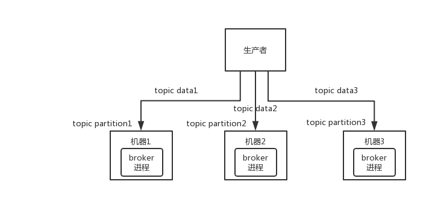

[Kafka的基本架构](#Kafka的基本架构) 

### Kafka的基本架构
(1)kafka集群有很多个kafka服务器，每个kafka服务器就是一个broker；  
(2)每一类消息有一个topic，topic可以划分为一个或者多个分区(partition)；  
(3)生产者生产一条消息，根据分发机制将这条消息分给这个topic下的某个partition的leader，每个partition只放topic的一部分数据；  
(4)每个partition可以存在于不同的broker上，就是说一个topic的数据是分散放在多个机器上的，这就是天然的分布式消息队列。

分发机制：
- 生产的消息指定了分区就发到特定分区下
- 指定了key，就根据murmur2哈希算法对key计算得到一个哈希值，将哈希值与分区数量取余，得到分区。
- 没有指定分区，也没有指定key，那么就根据一个自增计数与分区数取余得到分区，这样可以让消息分发在每个分区更加均匀。

Kafka 0.8以前，是没有HA机制的。任何一个broker宕机了，那个broker上的partition就废了，没法写也没法读，没有什么高可用性可言。  
比如说，假设创建了一个topic，指定partition数量是3个，分别在三台机器上。但是，如果第二台机器宕机了，会导致这个topic的1/3的数据就丢了，因此这个是做不到高可用的。  
  

Kafka 0.8以后，提供了HA机制，就是replica副本机制：  
(1)每个partition的数据都会同步到其它机器上，形成自己的多个replica副本；  
(2)所有replica会选举一个leader出来，那么生产和消费都跟这个leader打交道，其他replica就是follower；  
(3)写的时候，leader会负责把数据同步到所有follower上去，读的时候就直接读leader上的数据即可；  
(4)Kafka会均匀地将一个partition的所有replica分布在不同的机器上，提高容错性。
  

这样的话就有所谓的高可用性了。  
因为如果某个broker宕机了，那个broker上面的partition在其他机器上都有副本的。  
如果宕机的broker上面有某个partition的leader，那么此时会从follower中重新选举一个新的leader出来，继续读写那个新的leader即可。

写数据的时候，分区leader将消息存储到日志文件中后还不能算是写成功，会把消息同步给所有follower。  
当follower同步好消息之后就会给leader发ack，leader收到所有follower返回的ack之后，这条才算是写成功，然后才会给生产者返回写成功(依据ACK配置来决定多少follower同步成功才算生产者发送消息成功)。  

生产者ACK配置：  
- ack=1(默认)：数据发送到Kafka后，经过leader成功接收消息的的确认，就算是发送成功了。在这种情况下，如果leader宕机了，则会丢失数据。  
- ack=0：生产者将数据发送出去就不管了，不去等待任何返回。这种情况下数据传输效率最高，但是数据可靠性确是最低的。  
- ack=-1也就是all：producer需要等待所有follower都确认接收到数据后才算一次发送完成，可靠性最高。
