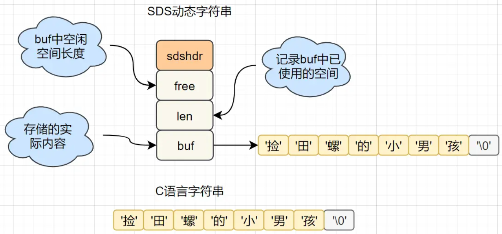

[基于内存实现](#基于内存实现)  
[高效的数据结构](#高效的数据结构)  
[合理的数据编码](#合理的数据编码)  
[合理的线程模型](#合理的线程模型)  
[虚拟内存机制](#虚拟内存机制)  

### 基于内存实现
内存读写是比磁盘读写快很多的。  
MySQL等磁盘数据库，数据存在磁盘，需要建立索引来加快查询效率；  
Redis是基于内存存储实现的数据库，数据存放在内存，直接操作内存，省去了磁盘I/O的消耗，所以就很快。
### 高效的数据结构
Redis的数据结构&内部编码图：  
  
**1. SDS简单动态字符串**
  
```
struct sdshdr { //SDS简单动态字符串
    int len;    //记录buf中已使用的空间
    int free;   // buf中空闲空间长度
    char buf[]; //存储的实际内容
}
```
(1) 字符串长度处理   
在C语言中，要获取捡田螺的小男孩这个字符串的长度，需要从头开始遍历，复杂度为O(n);  
在Redis中，已经有一个len字段记录当前字符串的长度啦，直接获取即可，时间复杂度为O(1)。  
(2) 减少内存重新分配的次数**  
在C语言中，修改一个字符串，需要重新分配内存，修改越频繁，内存分配就越频繁，而分配内存是会消耗性能的。  
而在Redis中，SDS提供了两种优化策略：空间预分配和惰性空间释放  
- 空间预分配  
当SDS简单动态字符串修改和空间扩充时，除了分配必需的内存空间，还会额外分配未使用的空间。分配规则是酱紫的：
```
SDS修改后len的长度小于1M：将额外分配与len相同长度的未使用空间。比如len=100，重新分配后，buf 的实际长度会变为100(已使用空间)+100(额外空间)+1(空字符)=201。
SDS修改后len长度大于1M：那么程序将分配1M的未使用空间。
```
- 惰性空间释放  
当SDS缩短时，不回收多余的内存空间，而是用free记录下多余的空间。后续再有修改操作，直接使用free中的空间，减少内存分配。
### 合理的数据编码
### 合理的线程模型
### 虚拟内存机制
