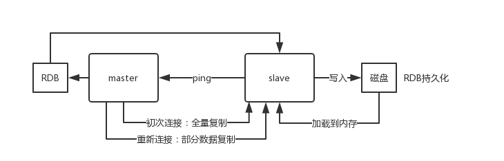

[Redis主从架构](#Redis主从架构)  
[主从复制的核心机制](#主从复制的核心机制)  
[主从复制的核心原理](#主从复制的核心原理)  
[复制的完整流程](#复制的完整流程) 

### Redis主从架构
主从(master-slave)架构，一主多从，将数据复制到slave节点，主节点负责写，从节点负责读。这样可以很轻松实现水平扩容，支撑读高并发。  
  
Redis replication -> 主从架构 -> 读写分离 -> 水平扩容支撑读高并发

### 主从复制的核心机制
- Redis采用异步方式复制数据到slave节点，不过Redis2.8开始，slave node会周期性地确认自己每次复制的数据量；
- 一个master node是可以配置多个slave node的；
- slave node也可以连接其他的slave node；
- slave node做复制的时候，不会block master node的正常工作；
- slave node在做复制的时候，也不会block对自己的查询操作，它会用旧的数据集来提供服务；但是复制完成的时候，需要删除旧数据集，加载新数据集，这个时候就会暂停对外服务了；
- slave node主要用来进行横向扩容，做读写分离，扩容的slave node可以提高读的吞吐量。  

注意，如果采用了主从架构，那么建议必须开启master node的持久化，不建议用slave node作为master node的数据热备，因为那样的话，如果你关掉master的持久化，可能在master宕机重启的时候数据是空的，然后可能一经过复制，slave node的数据也丢了。  
  
另外，master的各种备份方案，也需要做。万一本地的所有文件丢失了，从备份中挑选一份rdb去恢复master，这样才能确保启动的时候，是有数据的，即使采用了后续讲解的高可用机制，slave node可以自动接管master node，但也可能sentinel还没检测到master failure，master node就自动重启了，还是可能导致上面所有的slave node数据被清空。

### 主从复制的核心原理
(1) 当启动一个slave node的时候，它会发送一个PSYNC命令给master node；  
(2) 如果这是slave node初次连接到master node，那么会触发一次full resynchronization全量复制。此时master会启动一个后台线程，开始生成一份RDB快照文件，同时还会将从客户端client新收到的所有写命令缓存在内存中;   
(3) RDB文件生成完毕后，master会将这个RDB发送给slave，slave会先写入本地磁盘，然后再从本地磁盘加载到内存中，接着master会将内存中缓存的写命令发送到slave，slave也会同步这些数据；   
(4) slave node如果跟master node有网络故障，断开了连接，会自动重连，连接之后master node仅会复制给slave部分缺少的数据。


**主从复制的断点续传**  
从Redis2.8开始，就支持主从复制的断点续传，如果主从复制过程中，网络连接断掉了，那么可以接着上次复制的地方，继续复制下去，而不是从头开始复制一份。

从节点会将之前进行同步的Replication ID(一个随机字符串，标识主节点上的特定数据集)和offset(从服务器当前的复制偏移量)通过PSYNC id offset命令发送给主节点，主节点会进行判断：
- 如果Replication ID跟当前的Replication ID不一致(可能主节点进行了变化)，或者是当前buffer缓冲区中不存在对应的offset，那么会跟上面的初次复制一样，进行全量重同步。
- 如果Replication ID跟当前的Replication ID一致并且当前buffer缓冲区中存在对应的offset，那么会进行部分重同步。

**无磁盘化复制**  
master在内存中直接创建RDB ，然后发送给slave，不会在自己本地落地磁盘了。只需要在配置文件中开启repl-diskless-sync yes即可。
```
repl-diskless-sync yes

# 等待 5s 后再开始复制，因为要等更多 slave 重新连接过来
repl-diskless-sync-delay 5
```

**过期key处理**  
slave不会过期key，只会等待master过期key。如果master过期了一个key，或者通过LRU淘汰了一个key，那么会模拟一条del命令发送给slave。  

### 复制的完整流程
(1) slave node启动时，会在自己本地保存master node的信息，包括master node的host和ip，但是复制流程没开始。  
(2) slave node内部有个定时任务，每秒检查是否有新的master node要连接和复制，如果发现，就跟master node建立socket网络连接；  
(3) 然后slave node发送ping命令给master node。如果master设置了requirepass，那么slave node必须发送masterauth的口令过去进行认证；  
(4) master node第一次执行全量复制，将所有数据发给slave node。而在后续，master node持续将写命令异步复制给slave node。  


**全量复制**
- master执行bgsave，fork出一个子进程，在后台生成一个RDB持久化文件；
- master node将rdb快照文件发送给slave node，如果rdb复制时间超过60秒(repl-timeout)，那么slave node就会认为复制失败，可以适当调大这个参数(对于千兆网卡的机器，一般每秒传输100MB，6G文件，很可能超过60s)
- master node在生成rdb时，会使用一个缓冲区来记录这个期间执行的所有写命令，将这些命令发送给从节点，从节点执行命令将自己数据库状态更新至与主节点完全一致；  
- 如果在复制期间，内存缓冲区持续消耗超过64MB，或者一次性超过256MB，那么停止复制，复制失败；
- slave node接收到rdb之后，清空自己的旧数据，然后重新加载rdb到自己的内存中，同时基于旧的数据版本对外提供服务；
- 如果slave node开启了AOF，那么会立即执行BGREWRITEAOF，重写AOF。  

**增量复制**  
- 如果全量复制过程中，master-slave网络连接断掉，那么slave重新连接master时，会触发增量复制；
- 此时从节点只是落后主节点一小段时间的数据修改，并且偏移量在复制缓冲区buffer中可以找到，所以主节点把从节点落后的这部分数据修改命令发送给从节点，完成同步。

**heartbeat**  
主从节点互相都会发送heartbeat信息。  
master默认每隔10秒发送一次heartbeat，slave node每隔1秒发送一个heartbeat。

**命令传播**  
在执行全量复制或者增量复制以后，主从节点的数据库状态达到一致后，会进入到命令传播阶段。  
主节点执行修改命令后，会将修改命令添加到内存中的buffer缓冲区（是一个定长的环形数组，满了时就会覆盖前面的数据），然后异步地将buffer缓冲区的命令发送给从节点。

