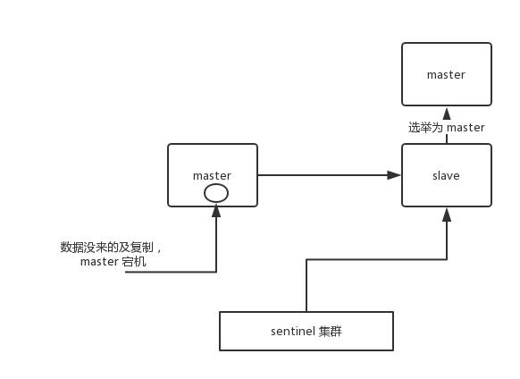

[哨兵介绍](#哨兵介绍)  
[哨兵主备切换的数据丢失问题](#哨兵主备切换的数据丢失问题)  
[哨兵集群的自动发现机制](#哨兵集群的自动发现机制)  
[自动故障转移](#自动故障转移)  
[quorum和majority](#quorum和majority)  
[configuration epoch](#configuration epoch)  
[configuration传播](#configuration传播)  

### 哨兵介绍
哨兵(sentinel)是Redis集群架构中非常重要的一个组件，主要有以下功能：
- 集群监控：负责监控 Redis master 和 slave 进程是否正常工作。
- 消息通知：如果某个 Redis 实例有故障，那么哨兵负责发送消息作为报警通知给管理员。
- 故障转移：如果 master node 挂掉了，会自动转移到slave node上。
- 配置中心：如果故障转移发生了，通知client客户端新的master地址。

哨兵用于实现Redis集群的高可用，本身也是分布式的，作为一个哨兵集群去运行，互相协同工作。
- 故障转移时，判断一个 master node是否宕机了，需要大部分的哨兵都同意才行，涉及到了分布式选举的问题。
- 即使部分哨兵节点挂掉了，哨兵集群还是能正常工作的。

### 核心知识
- 哨兵至少需要 3 个实例，来保证自己的健壮性。
- 哨兵 + Redis主从的部署架构，是不保证数据零丢失的，只能保证Redis集群的高可用性。
- 对于哨兵 + Redis主从这种复杂的部署架构，尽量在测试环境和生产环境，都进行充足的测试和演练。

哨兵集群必须部署2个以上节点。
```text
2 个哨兵，majority=2
3 个哨兵，majority=2
4 个哨兵，majority=2
5 个哨兵，majority=3
...
```  
如果哨兵集群仅仅部署了2个哨兵实例，quorum = 1。
```text
+----+         +----+
| M1 |---------| R1 |
| S1 |         | S2 |
+----+         +----+
```
配置quorum=1 ，如果master宕机，s1和s2中只要有1个哨兵认为master宕机了，就可以进行切换，同时s1和s2会选举出一个哨兵来执行故障转移。但是同时这个时候，需要majority，也就是大多数哨兵都是运行的。

如果此时仅仅是M1进程宕机了，哨兵s1正常运行，那么故障转移是OK的。  
但是如果是整个M1和S1运行的机器宕机了，那么哨兵只有1个，此时就没有majority来允许执行故障转移，虽然另外一台机器上还有一个R1，但是故障转移不会执行。

经典的3节点哨兵集群是这样的：
```text
       +----+
       | M1 |
       | S1 |
       +----+
          |
+----+    |    +----+
| R2 |----+----| R3 |
| S2 |         | S3 |
+----+         +----+
```
配置quorum=2，如果M1所在机器宕机了，那么三个哨兵还剩下2个，S2和S3可以一致认为master宕机了，然后选举出一个来执行故障转移，同时3个哨兵的majority是2，所以还剩下的2个哨兵运行着，就可以允许执行故障转移。

### 哨兵主备切换的数据丢失问题
主备切换的过程，可能会导致数据丢失，分两种情况：  

**(1) 异步复制导致的数据丢失**  
因为master->slave的复制是异步的，所以可能有部分数据还没复制到slave，master就宕机了，此时这部分数据就丢失了。
  

**(2) 脑裂导致的数据丢失**  
脑裂，也就是说某个master所在机器突然脱离了正常的网络，跟其他slave机器不能连接，但是实际上master还运行着。此时哨兵可能就会认为master宕机了，然后开启选举，将其他slave切换成了master。这个时候，集群里就会有两个master，也就是所谓的脑裂。

此时虽然某个slave被切换成了master，但是可能client还没来得及切换到新的master，还继续向旧master写数据。因此旧master再次恢复的时候，会被作为一个slave挂到新的master 上去，自己的数据会清空，重新从新的master复制数据。而新的master并没有后来client写入的数据，因此，这部分数据也就丢失了。
  

**数据丢失问题的解决方案**  
进行如下配置：
```text
min-slaves-to-write 1 //要求至少有1个slave
min-slaves-max-lag 10 //数据复制和同步的延迟不能超过10秒
```
如果说一旦所有的slave，数据复制和同步的延迟都超过了10秒钟，那么这个时候，master就不会再接收任何请求了。

- 减少异步复制数据的丢失
有了min-slaves-max-lag这个配置，就可以确保说，一旦slave复制数据和ack延时太长，就认为可能master宕机后损失的数据太多了，那么就拒绝写请求，这样可以把master宕机时由于部分数据未同步到slave导致的数据丢失降低的可控范围内。

- 减少脑裂的数据丢失
如果一个master出现了脑裂，跟其他slave丢了连接，那么上面两个配置可以确保说，如果不能继续给指定数量的slave发送数据，而且slave超过10秒没有给自己ack消息，那么就直接拒绝客户端的写请求。因此在脑裂场景下，最多就丢失10秒的数据。

### 哨兵集群的自动发现机制
(1) 哨兵互相之间的发现，是通过Redis的pub/sub系统实现的，每个哨兵都会往__sentinel__:hello这个channel里发送一个消息，这时候所有其他哨兵都可以消费到这个消息，并感知到其他的哨兵的存在。  
(2) 每隔两秒钟，每个哨兵都会往自己监控的某个master+slaves对应的 __sentinel__:hello channel里发送一个消息，内容是自己的host、ip和runid，还有对这个 master 的监控配置。  
(3) 每个哨兵也会去监听自己监控的每个master+slaves对应的 __sentinel__:hello channel，然后去感知到同样在监听这个master+slaves的其他哨兵的存在。  
(4) 每个哨兵还会跟其他哨兵交换对master的监控配置，互相进行监控配置的同步。

### 客户端是怎么接入哨兵系统的？
配置提供者：负责存储当前最新的主从节点信息，供客户端获取。
代理：客户端所有请求都会经过哨兵节点。

首先Redis中的哨兵节点是一个配置提供者，而不是代理。因为客户端只是在首次连接时从哨兵节点获取主节点信息，后续直接与主节点进行连接，发送请求，接收请求结果。

具体流程：  
(1) 通过在客户端配置哨兵节点的地址+主节点的名称(哨兵系统可能会监控多个主从节点，名称用于区分)就可以与哨兵节点建立连接，获取到主节点信息，然后与主节点建立连接，并且订阅哨兵节点的+switch-master频道；   
(2) 一旦主节点发送故障，哨兵服务器对主节点进行自动故障转移，会将从节点升级主节点，并且更新哨兵服务器中存储的主节点信息，会向+switch-master频道发送消息，客户端得到消息后重新从哨兵节点获取主节点信息，初始化连接池。

### 自动故障转移
**sdown和odown转换机制**  
sdown：主观宕机，就一个哨兵如果自己觉得一个master宕机了，那么就是主观宕机  
odown：客观宕机，如果quorum 数量的哨兵都觉得一个master宕机了，那么就是客观宕机  

sdown达成的条件很简单，如果一个哨兵 ping 一个 master，超过了is-master-down-after-milliseconds指定的毫秒数之后，就主观认为 master 宕机了；  
如果一个哨兵在指定时间内，收到了quorum数量的其它哨兵也认为那个master是sdown的，那么就认为是odown了。  

1.认定主节点主观下线   
每隔2s，哨兵节点会给主节点发送PING命令，如果在一定时间间隔内，都没有收到回复，那么哨兵节点就认为主节点主观下线。

2.认定主节点客观下线  
哨兵节点认定主节点主观下线后，会向其他哨兵节点发送sentinel is-master-down-by-addr命令，获取其他哨兵节点对该主节点的状态；  
当认定主节点下线的哨兵数量达到一定数值时(这个阀值是Sentinel配置中quorum参数的值，通常我们设置为哨兵总节点数的1/2)，就认定主节点客观下线。

3.进行领导者哨兵选举  
认定主节点客观下线后,各个哨兵之间相互通信，选举出一个领导者哨兵，由它来对主节点进行故障转移操作。

选举使用的是Raft算法，基本思路：  
哨兵节点A会先其他哨兵节点，发送命令，申请成为该哨兵节点B的领导者。如果B还没有同意过其他哨兵节点，那么就同意A成为领导者，最终得票超过半数以上的哨兵节点会赢得选举，如果本次投票，没有选举出领导者哨兵，那么就开始新一轮的选举，直到选举出哨兵节点(实际开发中，最先判定主节点客观下线的哨兵节点，一般就能成为领导者。)

4.领导者哨兵进行故障转移  
领导者哨兵执行主备切换操作，首先要选举一个slave来，会考虑slave的一些信息：
- 跟 master 断开连接的时长
- slave 优先级
- 复制 offset
- run id

如果一个slave跟master断开连接的时间已经超过了down-after-milliseconds的10倍，外加master宕机的时长，那么slave就被认为不适合选举为master。  
(down-after-milliseconds * 10) + milliseconds_since_master_is_in_SDOWN_state

接下来会对 slave 进行排序：
- 按照 slave 优先级进行排序，slave priority 越低，优先级就越高。
- 如果 slave priority 相同，那么看 replica offset，哪个 slave 复制了越多的数据，offset 越靠后，优先级就越高。
- 如果上面两个条件都相同，那么选择一个 run id 比较小的那个 slave。

向这个从节点发送slaveof no one命令，让其成为主节点，通过slaveof命令让其他从节点成为它的从节点，将已下线的主节点更新为新的主节点的从节点，将其他从节点的复制目标改完新的主节点，将旧的主服务器改为从服务器。

### quorum和majority
每次一个哨兵要做主备切换，首先需要quorum数量的哨兵认为master节点客观宕机，然后选举出一个哨兵来做切换，这个哨兵还需要得到majority哨兵的授权，才能正式执行切换。

如果quorum < majority，比如5个哨兵，majority就是3，quorum设置为2，那么就3个哨兵授权就可以执行切换。  
但是如果quorum >= majority，那么必须quorum数量的哨兵都授权，比如5个哨兵，quorum是5，那么必须5个哨兵都同意授权，才能执行切换。

### configuration epoch
哨兵会对一套Redis master+slaves进行监控，有相应的监控的配置。

执行切换的那个哨兵，会从要切换到的新master(salve->master)那里得到一个configuration epoch，这就是一个version号，每次切换的version号都必须是唯一的。

如果第一个选举出的哨兵切换失败了，那么其他哨兵会等待failover-timeout时间，然后接替继续执行切换，此时会重新获取一个新的configuration epoch，作为新的version号。

### configuration传播
哨兵完成切换之后，会在自己本地更新生成最新的master配置，然后同步给其他的哨兵，就是通过之前说的pub/sub消息机制。

这里之前的version号就很重要了，因为各种消息都是通过一个channel去发布和监听的，所以一个哨兵完成一次新的切换之后，新的master配置是跟着新的version号的。其他的哨兵都是根据版本号的大小来更新自己的master配置的。