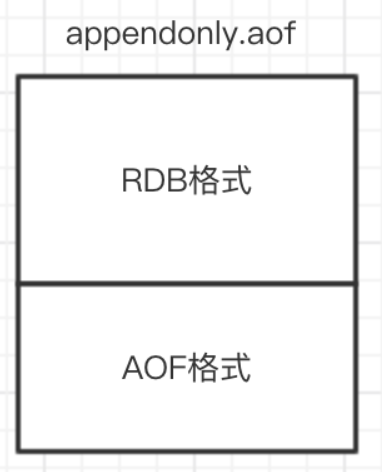

[Redis的持久化实现](#Redis的持久化实现)  
[AOF和RDB对比](#AOF和RDB对比)  
[怎么防止AOF文件越来越大？](#怎么防止AOF文件越来越大？)   
[持久化策略选择](#持久化策略选择)   
[AOF文件追加阻塞](#AOF文件追加阻塞)   
[RDB-AOF混合持久化](#RDB-AOF混合持久化)   

### Redis的持久化实现
Redis是基于内存的数据库，一旦断电，所有实例都会关机，所有数据都会丢失。  
在运行期间，可以通过开启Redis的持久化功能，将数据写入磁盘，供实例重启时恢复数据。  
Redis主要通过AOF和RDB实现持久化。

**AOF持久化**  
(1) Redis在修改相关的命令后，将命令添加到aof_buf缓存区(aof_buf是Redis中的SDS结构)的末尾；  
(2) 在每次事件循环结束时，根据appendfsync的配置(always是每次事件循环都将aof_buf缓冲区的内容写入，everysec是每秒写入，no是根据操作系统来决定何时写入)，判断是否需要将aof_buf写入AOF文件。  
生产环境中一般用默认配置everysec，也就是每秒写入一次，一旦挂机会丢掉1秒钟的数据。
```
struct redisServer {
 /* AOF buffer, written before entering the event loop */
 sds aof_buf;//aof_buf缓冲区其实就是Redis的一个简单动态字符串
 }
struct sdshdr {
    unsigned int len;
    unsigned int free;
    char buf[];
};
```

**RDB持久化**  
RDB持久化指的是在满足一定的触发条件时(在一个的时间间隔内执行修改命令达到一定的数量，或者手动执行SAVE和BGSAVE命令)，对这个时间点的数据库所有键值对信息生成一个压缩文件dump.rdb，然后将旧的删除，进行替换。  
在Redis默认的配置下，RDB是开启的，AOF持久化是关闭的。

实现原理  
(1) fork一个子进程，然后对键值对进行遍历，生成rdb文件；  
(2) 在生成过程中，父进程会继续处理客户端发送的请求，当父进程要对数据进行修改时，会对相关的内存页进行拷贝，修改的是拷贝后的数据。
(也就是COPY ON WRITE，写时复制技术，就是当多个调用者同时请求同一个资源，如内存或磁盘上的数据存储，他们会共用同一个指向资源的指针，指向相同的资源，只有当一个调用者试图修改资源的内容时，系统才会真正复制一份专用副本给这个调用者，其他调用者还是使用最初的资源,在CopyOnWriteArrayList的实现中，也有用到，添加或者插入一个新元素时过程是，加锁，对原数组进行复制，然后添加新元素，然后替代旧数组，解锁）
```java
//CopyOnWriteArrayList的添加元素的方法
public boolean add(E e) {
   final ReentrantLock lock = this.lock;
   lock.lock();
   try {
        Object[] elements = getArray();
        int len = elements.length;
        Object[] newElements = Arrays.copyOf(elements, len + 1);
        newElements[len] = e;
        setArray(newElements);
        return true;
   } finally {
        lock.unlock();
   }     
}
```

### AOF和RDB对比
**AOF优缺点**  
(1) 保存了所有执行的修改命令，粒度更细，进行数据恢复时，恢复的数据更加完整，但是由于需要对所有命令执行一遍，效率比较低；    
(2) AOF可以更好的保护数据不丢失，一般AOF会每隔1秒，通过一个后台线程执行一次fsync操作，最多丢失1秒钟的数据；  
(3) AOF日志文件以**append-only模式**写入，所以没有任何磁盘寻址的开销，写入性能非常高，而且文件不容易破损，即使文件尾部破损，也很容易修复；  
(4) AOF日志文件即使过大的时候，出现后台重写操作，也不会影响客户端的读写。因为在rewrite log的时候，会对其中的指令进行压缩，创建出一份需要恢复数据的最小日志出来。在创建新日志文件的时候，老的日志文件还是照常写入。当新的merge后的日志文件ready的时候，再交换新老日志文件即可；  
(5) AOF日志文件的命令通过可读较强的方式进行记录，这个特性非常适合做灾难性的误删除的紧急恢复。比如某人不小心用flushall命令清空了所有数据，只要这个时候后台rewrite还没有发生，那么就可以立即拷贝AOF文件，将最后一条flushall命令给删了，然后再将该AOF文件放回去，就可以通过恢复机制，自动恢复所有数据；  
(6) 因为是保存了所有的修改命令，同样的数据集，AOF日志文件通常比RDB数据快照文件更大。而且随着执行时间的增加，AOF文件可能会越来越大，可以通过执行BGREWRITEAOF命令来重新生成AOF文件，减小文件大小；  
(7) AOF开启后，支持的写QPS会比RDB支持的写QPS低，因为AOF一般会配置成每秒fsync一次日志文件，当然，每秒一次fsync，性能也还是很高的；(如果实时写入，那么QPS会大降，Redis性能会大大降低)  
(8) 以前AOF发生过bug，就是通过AOF记录的日志，进行数据恢复的时候，没有恢复一模一样的数据出来。所以说，类似AOF这种较为复杂的基于命令日志merge回放的方式，比基于RDB每次持久化一份完整的数据快照文件的方式，更加脆弱一些，容易有bug。不过AOF就是为了避免rewrite过程导致的bug，因此每次rewrite并不是基于旧的指令日志进行merge的，而是基于当时内存中的数据进行指令的重新构建，这样健壮性会好很多；   
(9) Redis服务器故障重启后，默认恢复数据的方式首选是通过AOF文件恢复，其次是通过RDB文件恢复，因为AOF中的数据更加完整。

**RDB优缺点**   
(1) 保存某一个时间点的所有键值对信息，所以恢复时可能会丢失一部分数据，但是恢复效率会比较高；   
(2) RDB会生成多个数据文件，每个数据文件都代表了某一个时刻中Redis的数据，这种多个数据文件的方式，非常适合做冷备，可以将这种完整的数据文件发送到一些远程的安全存储上去，比如说 Amazon 的 S3 云服务上去，在国内可以是阿里云的ODPS分布式存储上，以预定好的备份策略来定期备份Redis中的数据；  
(3) RDB对Redis对外提供的读写服务，影响非常小，可以让Redis保持高性能。因为 Redis 主进程只需要fork一个子进程，让子进程执行磁盘IO操作来进行RDB持久化即可；  
(4) 相对于AOF持久化机制来说，直接基于RDB数据文件来重启和恢复Redis进程，更加快速；  
(5) 如果想要在Redis故障时，尽可能少的丢失数据，那么RDB没有AOF好。一般来说，RDB数据快照文件，都是每隔5分钟，或者更长时间生成一次，这个时候就得接受一旦Redis进程宕机，那么会丢失最近5分钟(甚至更长时间)的数据；  
(6) RDB每次在fork子进程来执行RDB快照数据文件生成的时候，如果数据文件特别大，可能会导致对客户端提供的服务暂停数毫秒，或者甚至数秒。

### 怎么防止AOF文件越来越大？
为了防止AOF文件越来越大，可以通过执行BGREWRITEAOF命令进行AOF重写，会fork子进程出来，读取当前数据库的键值对信息，生成所需的写命令，写入新的AOF文件。  
在生成期间，父进程继续正常处理请求，执行修改命令后，不仅会将命令写入aof_buf缓冲区，还会写入重写aof_buf缓冲区。当新的AOF文件生成完毕后，子进程父进程发送信号，父进程将重写aof_buf缓冲区的修改命令写入新的AOF文件，写入完毕后，对新的AOF文件进行改名，原子地(atomic)地替换旧的AOF文件。

AOF重写命令可以手动执行，在满足一些条件时，Redis也会自动触发。自动触发的条件如下：
- 没有 BGSAVE 命令在执行。
- 没有 BGREWRITEAOF 在执行。
- 当前AOF文件大小 > server.aof_rewrite_min_size(默认为1MB)。
- 当前AOF文件大小和最后一次AOF重写后的大小之间的比率大于等于指定的增长百分比(默认为1倍，100%，也就是当前AOF文件大小>=上次重写后文件的2倍后)

### 持久化策略选择
RDB持久化的特点是：文件小，恢复快，不影响性能，实时性低，兼容性差(老版本的Redis不兼容新版本的RDB文件)；  
AOF持久化的特点是：文件大，恢复慢，性能影响大，实时性高。是目前持久化的主流(主要是当前项目开发不太能接受大量数据丢失的情况)。  
需要了解的是持久化选项的开启必然会造成一定的性能消耗。

两种持久化方式的缺点：  
RDB持久化主要在于bgsave在进行fork操作时，会阻塞Redis的主线程，以及向硬盘写数据会有一定的I/O压力。  
AOF持久化主要在于将aof_buf缓冲区的数据同步到磁盘时会有I/O压力，而且向硬盘写数据的频率会高很多。其次是，AOF文件重写跟RDB持久化类似，也会有fork时的阻塞和向硬盘写数据的压力。

以下是几种持久化方案选择的场景：  
1.不需要考虑数据丢失的情况  
那么不需要考虑持久化。

2.单机实例情况下
可以接受丢失十几分钟及更长时间的数据，可以选择RDB持久化，对性能影响小；  
如果只能接受秒级的数据丢失，只能选择AOF持久化。

3.在主从环境下
因为主服务器在执行修改命令后，会将命令发送给从服务器，从服务进行执行后，与主服务器保持数据同步，实现数据热备份，在master宕掉后继续提供服务。同时也可以进行读写分离，分担Redis的读请求。

那么在从服务器进行数据热备份的情况下，是否还需要持久化呢？  
需要持久化。因为不进行持久化，主/从服务器同时出现故障时(例如：机房全部机器断电)，会导致数据丢失。  
如果系统中有自动拉起机制(即检测到服务停止后重启该服务)将master自动重启，由于没有持久化文件，那么master重启后数据是空的，slave同步数据也变成了空的。应尽量避免“自动拉起机制”和“不做持久化”同时出现。

所以一般可以采用以下方案：  
主服务器不开启持久化，使得主服务器性能更好。  
从服务器开启AOF持久化，关闭RDB持久化，并且定时对AOF文件进行备份，以及在凌晨执行bgaofrewrite命令来进行AOF文件重写，减小AOF文件大小。（当然如果对数据丢失容忍度高也可以开启RDB持久化，关闭AOF持久化）

4.异地灾备  
一般性的故障(停电，关机)不会影响到磁盘，但是一些灾难性的故障(地震，洪水)会影响到磁盘，所以需要定时把单机上或从服务器上的AOF文件，RDB文件备份到其他地区的机房。  

### AOF文件追加阻塞
修改命令添加到aof_buf之后，如果配置是everysec，那么会有一个线程每秒执行fsync操作，调用write写入磁盘一次；  
但是如果此时来了很多Redis请求，Redis主线程持续高速向aof_buf写入命令，硬盘的负载可能会越来越大，IO资源消耗更快，fsync操作可能会超过1s，aof_buf缓冲区堆积的命令会越来越多，所以Redis的处理逻辑是会对比上次fsync成功的时间，如果超过2s，则主线程阻塞直到fsync同步完成，所以最多可能丢失2s的数据，而不是1s；  
每当AOF追加阻塞事件发生时，在info Persistence 统计中，aof_delayed_fsync指标会累加，查看这个指标方便定位AOF阻塞问题。

### RDB-AOF混合持久化
redis4.0相对与3.X版本其中一个比较大的变化是4.0添加了新的混合持久化方式。  
混合持久化就是同时结合RDB持久化以及AOF持久化混合写入AOF文件。这样做的好处是可以结合rdb和aof的优点, 快速加载同时避免丢失过多的数据，缺点是aof里面的rdb部分就是压缩格式不再是aof格式，可读性差。

**开启混合持久化**  
4.0版本的混合持久化默认关闭的，通过aof-use-rdb-preamble配置参数控制，yes则表示开启，no表示禁用，默认是禁用的，可通过config set修改。

**混合持久化过程**  
混合持久化同样也是通过BGREWRITEAOF完成的，不同的是当开启混合持久化时，fork出的子进程先将共享的内存副本全量的以RDB方式写入aof文件，然后在将重写缓冲区的增量命令以AOF方式写入到文件，写入完成后通知主进程更新统计信息，并将新的含有RDB格式和AOF格式的AOF文件替换旧的的AOF文件。  
简单的说：新的AOF文件前半段是RDB格式的全量数据后半段是AOF格式的增量数据，如下图：


**数据恢复**  
当我们开启了混合持久化时，启动redis依然优先加载aof文件，aof文件加载可能有两种情况如下：  
aof文件开头是rdb的格式, 先加载rdb内容再加载剩余的aof；  
aof文件开头不是rdb的格式，直接以aof格式加载整个文件。

**优缺点**  
优点：混合持久化结合了RDB持久化和AOF持久化的优点, 由于绝大部分都是RDB格式，生成的AOF文件体积更小，加载速度快，同时结合AOF，增量的数据以AOF方式保存了，数据更少的丢失；  
缺点：兼容性差，一旦开启了混合持久化，在4.0之前版本都不识别该aof文件，同时由于前部分是RDB格式，阅读性较差。


