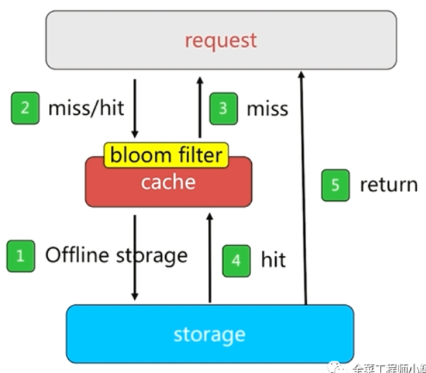

[缓存穿透](#缓存穿透)  
[缓存击穿](#缓存击穿)  
[缓存雪崩](#缓存雪崩)  
[缓存预热](#缓存预热)

### 缓存穿透
Redis缓存穿透指的是攻击者故意大量请求一些Redis缓存中不存在key的数据，导致请求打到数据库上，造成数据库压力过大。  

解决方案如下：  
1.对缓存中找不到，去数据库也找不到的key，写一个空值到缓存里去，比如 set -999 UNKNOWN。  
但是可能会导致Redis中缓存大量无效的key，可以设置一个很短的过期时间，例如1分钟。
这样的话，下次有相同的key来访问的时候，在缓存失效之前，都可以直接从缓存中取数据。

当然，如果攻击者每次使用不同的key来攻击，写空值的方法可能就不奏效了。
更为经常的做法是在缓存之前增加布隆过滤器。

2.布隆过滤器

在缓存之前增加布隆过滤器，将数据库中所有可能的数据哈希映射到布隆过滤器中。然后对每个请求进行如下判断：
- 请求数据的 key 不存在于布隆过滤器中，可以确定数据就一定不会存在于数据库中，系统可以立即返回不存在。
- 请求数据的 key 存在于布隆过滤器中，则继续再向缓存中查询。  

使用布隆过滤器能够对访问的请求起到了一定的初筛作用，避免了因数据不存在引起的查询压力。

### 缓存击穿
缓存击穿指某个key非常热点，访问非常频繁，处于集中式高并发访问的情况。
当这个key在失效的瞬间，大量的请求就击穿了缓存，直接请求数据库，就像是在一道屏障上凿开了一个洞。

不同场景下的解决方式可如下：
- 若缓存的数据是基本不会发生更新的，则可尝试将该热点数据设置为永不过期；
- 若缓存的数据更新不频繁，且缓存刷新的整个流程耗时较少的情况下，则可以采用基于Redis、zookeeper等分布式中间件的分布式互斥锁，或者本地互斥锁以保证仅少量的请求能请求数据库并重新构建缓存，其余线程则在锁释放后能访问到新缓存；
- 若缓存的数据更新频繁或者在缓存刷新的流程耗时较长的情况下，可以利用定时线程在缓存过期前主动地重新构建缓存或者延后缓存的过期时间，以保证所有的请求能一直访问到对应的缓存。

### 缓存雪崩
缓存雪崩主要指短时间内大量key同时失效，导致所有请求全部转向数据库，导致数据库压力过大。

解决方案：  
1.设置随机过期时间  
不同的key，设置不同的过期时间，让缓存失效时间分散开。  
比如可以在原有的失效时间基础上增加一个随机值，比如1-5分钟随机，这样每一个缓存的过期时间的重复率就会降低。

2.双缓存机制  
缓存A的失效时间为20分钟，缓存B的失效时间会比A长一些；  
从缓存A读取数据，缓存A中没有时，去缓存B中读取数据；  
并且启动一个异步线程来更新缓存A(如果已经有异步线程正在更新了，就不用重复更新了)。以及更新缓存B，以便延迟B的过期时间。

3.缓存“永远不过期”  
“永远不过期”包含两个层面：  
(1)从redis上看，确实没有设置过期时间，这就保证了，不会出现热点key过期问题，也就是“物理”不过期。  
(2)从功能上看，把过期时间存在key对应的value里，如果发现要过期了，通过一个后台的异步线程进行缓存的构建，也就是“逻辑”不过期。

这种方法对于性能非常友好，唯一不足的就是构建缓存时候，其余线程(非构建缓存的线程)可能访问的是老数据，但是对于一般的互联网功能来说这个还是可以忍受。

4.互斥锁  
在缓存失效后，通过加锁或者队列来控制读数据库写缓存的线程数量。比如对某个key只允许一个线程查询数据和写缓存，其他线程等待。

### 缓存预热
有效应对缓存的击穿/雪崩的一种方式是缓存预热。  
缓存预热就是系统上线前，将相关的缓存数据直接加载到缓存系统，用户直接查询事先被预热的缓存数据。这样就可以避免在用户请求的时候，先查询数据库，然后再将数据缓存的问题。

解决思路：  
(1)直接写个缓存刷新页面，上线时手工操作下；  
(2)数据量不大，可以在项目启动的时候自动进行加载；  
(3)定时刷新缓存。