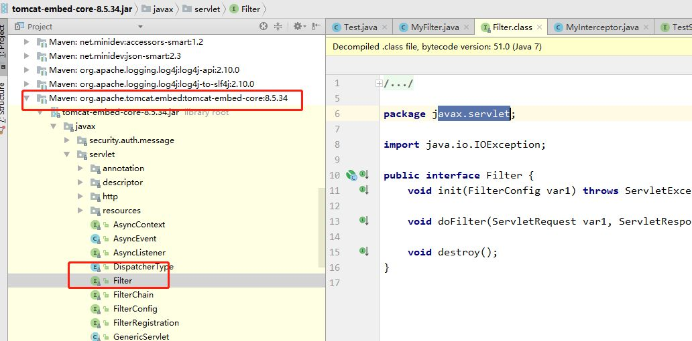
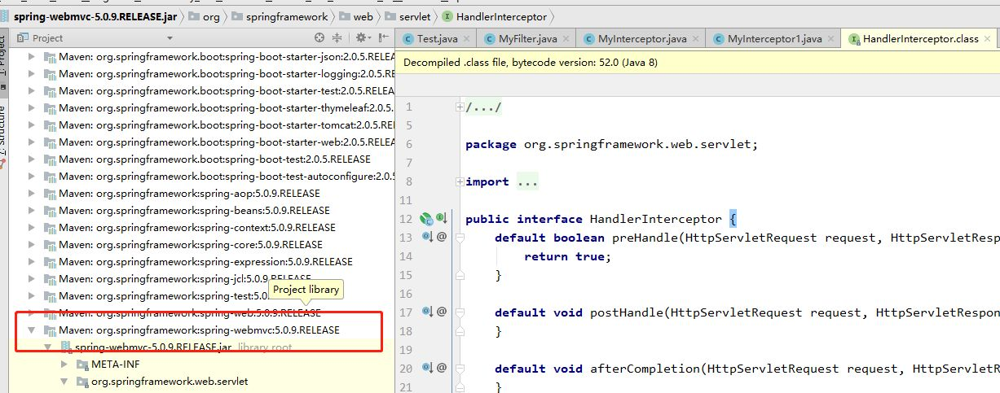

[实现原理不同](#实现原理不同)  
[使用范围不同](#使用范围不同)  
[触发时机不同](#触发时机不同)
### 实现原理不同
(1) 过滤器是基于函数回调的；  
(2) 拦截器则是基于Java的反射机制(动态代理)实现的。

这里重点说下过滤器:  
在我们自定义的过滤器中都会实现一个doFilter()方法，这个方法有一个FilterChain参数。而实际上FilterChain是一个回调接口，有一个doFilter()方法，就是回调方法：
```java
public interface FilterChain {
    void doFilter(ServletRequest var1, ServletResponse var2) throws IOException, ServletException;
}
```
ApplicationFilterChain是FilterChain接口的实现类，重写了doFilter()方法。ApplicationFilterChain里面能拿到我们自定义的xxxFilter类，在doFilter()里调用各个自定义xxxFilter过滤器的doFilter() 方法：  
```java
public final class ApplicationFilterChain implements FilterChain {
    @Override
    public void doFilter(ServletRequest request, ServletResponse response) {
            ...//省略
            internalDoFilter(request,response);
    }
 
    private void internalDoFilter(ServletRequest request, ServletResponse response){
    if (pos < n) {
            //获取第pos个filter    
            ApplicationFilterConfig filterConfig = filters[pos++];        
            Filter filter = filterConfig.getFilter();
            ...
            filter.doFilter(request, response, this);
        }
    }
}
```
而每个xxxFilter会先执行自身的过滤逻辑，最后在执行结束前会执行filterChain.doFilter(servletRequest, servletResponse)，也就是回调ApplicationFilterChain的doFilter()方法，以此循环执行实现函数回调：  
```java
@Override
public void doFilter(ServletRequest servletRequest, ServletResponse servletResponse, FilterChain filterChain) throws IOException, ServletException {
	filterChain.doFilter(servletRequest, servletResponse);
}
```
### 使用范围不同
(1) 过滤器实现的是javax.servlet.Filter接口，而这个接口是在Servlet规范中定义的，也就是说过滤器Filter 的使用要依赖于Tomcat等容器，导致它只能在web程序中使用：  


(2) 而拦截器(Interceptor) 是一个Spring组件，并由Spring容器管理，并不依赖Tomcat等容器，是可以单独使用的。不仅能应用在web程序中，也可以用于Application、Swing等程序中：  

### 触发时机不同
