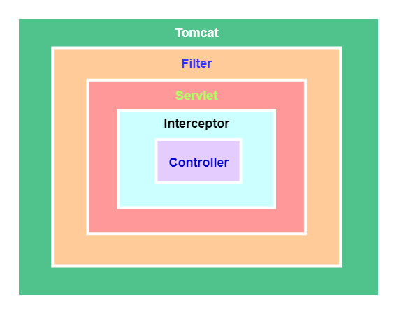
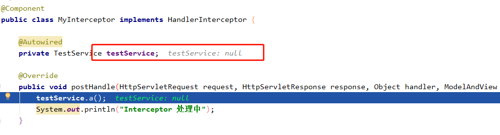

[实现原理不同](#实现原理不同)  
[使用范围不同](#使用范围不同)  
[触发时机不同](#触发时机不同)  
[拦截的请求范围不同](#拦截的请求范围不同)  
[注入Bean情况不同](#注入Bean情况不同)  
[控制执行顺序不同](#控制执行顺序不同)

### 实现原理不同
(1) 过滤器是基于函数回调的；  
(2) 拦截器则是基于Java的反射机制(动态代理)实现的。

这里重点说下过滤器:  
在我们自定义的过滤器中都会实现一个doFilter()方法，这个方法有一个FilterChain参数。而实际上FilterChain是一个回调接口，有一个doFilter()方法，就是回调方法：
```java
public interface FilterChain {
    void doFilter(ServletRequest var1, ServletResponse var2) throws IOException, ServletException;
}
```
ApplicationFilterChain是FilterChain接口的实现类，重写了doFilter()方法。ApplicationFilterChain里面能拿到我们自定义的xxxFilter类，在doFilter()里调用各个自定义xxxFilter过滤器的doFilter() 方法：  
```java
public final class ApplicationFilterChain implements FilterChain {
    @Override
    public void doFilter(ServletRequest request, ServletResponse response) {
            ...//省略
            internalDoFilter(request,response);
    }
 
    private void internalDoFilter(ServletRequest request, ServletResponse response){
    if (pos < n) {
            //获取第pos个filter    
            ApplicationFilterConfig filterConfig = filters[pos++];        
            Filter filter = filterConfig.getFilter();
            ...
            filter.doFilter(request, response, this);
        }
    }
}
```
而每个xxxFilter会先执行自身的过滤逻辑，最后在执行结束前会执行filterChain.doFilter(servletRequest, servletResponse)，也就是回调ApplicationFilterChain的doFilter()方法，以此循环执行实现函数回调：  
```java
@Override
public void doFilter(ServletRequest servletRequest, ServletResponse servletResponse, FilterChain filterChain) throws IOException, ServletException {
	filterChain.doFilter(servletRequest, servletResponse);
}
```

### 使用范围不同
(1) 过滤器实现的是javax.servlet.Filter接口，而这个接口是在Servlet规范中定义的，也就是说过滤器Filter 的使用要依赖于Tomcat等容器，导致它只能在web程序中使用：  

  
(2) 而拦截器(Interceptor)是一个Spring组件，并由Spring容器管理，并不依赖Tomcat等容器，是可以单独使用的。不仅能应用在web程序中，也可以用于Application、Swing等程序中：  


### 触发时机不同

(1) 过滤器Filter是在请求进入容器后，但在进入servlet之前进行预处理，请求结束是在servlet处理完以后。  
(2) 拦截器(Interceptor)是在请求进入servlet后，在进入Controller之前进行预处理的，Controller 中渲染了对应的视图之后请求结束。

### 拦截的请求范围不同
同时配置过滤器和拦截器，再建一个Controller接收请求测试一下：  
```java
@RestController
public class Test {
    @RequestMapping("/test1")
    public String test1(String a) {
        System.out.println("我是controller");
        return null;
    }
}
```
浏览器发送请求，F12 看到居然有两个请求，一个是我们自定义的 Controller 请求，另一个是访问静态图标资源的请求：  
执行顺序：Filter 处理中 -> Interceptor 前置 -> 我是controller -> Interceptor 处理中 -> Interceptor 处理后  
控制台的打印日志如下：  
```
Filter 处理中
Interceptor 前置
Interceptor 处理中
Interceptor 后置
Filter 处理中
```
过滤器Filter执行了两次，拦截器Interceptor只执行了一次。这是因为过滤器几乎可以对所有进入容器的请求起作用，而拦截器只会对Controller中请求或访问static目录下的资源请求起作用。

### 注入Bean情况不同
在实际的业务场景中，应用到过滤器或拦截器，为处理业务逻辑难免会引入一些service服务。  
下边我们分别在过滤器和拦截器中都注入service，看看有什么不同？  
在过滤器中注入service：  
```java
@Component
public class TestServiceImpl implements TestService {
    @Override
    public void a() {
        System.out.println("我是方法A");
    }
}
```
```java
@Autowired //注入service
private TestService testService;
@Override
public void doFilter(ServletRequest servletRequest, ServletResponse servletResponse, FilterChain filterChain) throws IOException, ServletException {
    System.out.println("Filter 处理中");
    testService.a();
    filterChain.doFilter(servletRequest, servletResponse);
}
```
日志正常打印：
```
Filter 处理中
我是方法A
Interceptor 前置
我是controller
Interceptor 处理中
Interceptor 后置
```
在拦截器中注入service：  
发起请求测试一下 ，竟然报错了，debug发现注入的service怎么是null？ 

这是因为加载顺序导致的问题，拦截器加载的时间点在springcontext之前，而Bean又是由spring进行管理。  
解决方案也很简单，我们在注册拦截器之前，先将Interceptor 手动进行注入。
```java
@Configuration
public class MyMvcConfig implements WebMvcConfigurer {
    @Bean
    public MyInterceptor getMyInterceptor(){
        System.out.println("注入了MyInterceptor");
        return new MyInterceptor();
    }
 
    @Override
    public void addInterceptors(InterceptorRegistry registry) {

        registry.addInterceptor(getMyInterceptor()).addPathPatterns("/**");
    }
}
```
注意：在registry.addInterceptor()注册的是getMyInterceptor() 实例。

### 控制执行顺序不同
实际开发过程中，会出现多个过滤器或拦截器同时存在的情况。有时我们希望某个过滤器或拦截器能优先执行，就涉及到它们的执行顺序。

过滤器用@Order注解控制执行顺序，通过@Order控制过滤器的级别，值越小级别越高越先执行。
```java
@Order(Ordered.HIGHEST_PRECEDENCE)
@Component
public class MyFilter2 implements Filter {
```

拦截器默认的执行顺序，就是它的注册顺序，也可以通过Order手动设置控制，值越小越先执行。
```java
@Override
public void addInterceptors(InterceptorRegistry registry) {
    registry.addInterceptor(new MyInterceptor2()).addPathPatterns("/**").order(2);
    registry.addInterceptor(new MyInterceptor1()).addPathPatterns("/**").order(1);
    registry.addInterceptor(new MyInterceptor()).addPathPatterns("/**").order(3);
}
```
日志打印：
```
Interceptor1 前置
Interceptor2 前置
Interceptor 前置
我是controller
Interceptor 处理中
Interceptor2 处理中
Interceptor1 处理中
Interceptor 后置
Interceptor2 处理后
Interceptor1 处理后
```
看到输出结果发现，先声明的拦截器 preHandle() 方法先执行，而postHandle()方法反而会后执行。

postHandle() 方法被调用的顺序跟 preHandle() 居然是相反的！如果实际开发中严格要求执行顺序，那就需要特别注意这一点。
那为什么会这样呢？ 得到答案就只能看源码了，我们要知道controller 中所有的请求都要经过核心组件DispatcherServlet路由，都会执行它的 doDispatch() 方法，而拦截器postHandle()、preHandle()方法便是在其中调用的。
```java
protected void doDispatch(HttpServletRequest request, HttpServletResponse response) throws Exception {
 
        try {
         ...........
            try {
 
                // 获取可以执行当前Handler的适配器
                HandlerAdapter ha = getHandlerAdapter(mappedHandler.getHandler());

                // Process last-modified header, if supported by the handler.
                String method = request.getMethod();
                boolean isGet = "GET".equals(method);
                if (isGet || "HEAD".equals(method)) {
                    long lastModified = ha.getLastModified(request, mappedHandler.getHandler());
                    if (logger.isDebugEnabled()) {
                        logger.debug("Last-Modified value for [" + getRequestUri(request) + "] is: " + lastModified);
                    }
                    if (new ServletWebRequest(request, response).checkNotModified(lastModified) && isGet) {
                        return;
                    }
                }
                // 注意： 执行Interceptor中PreHandle()方法
                if (!mappedHandler.applyPreHandle(processedRequest, response)) {
                    return;
                }

                // 注意：执行Handle【包括我们的业务逻辑，当抛出异常时会被Try、catch到】
                mv = ha.handle(processedRequest, response, mappedHandler.getHandler());

                if (asyncManager.isConcurrentHandlingStarted()) {
                    return;
                }
                applyDefaultViewName(processedRequest, mv);

                // 注意：执行Interceptor中PostHandle 方法【抛出异常时无法执行】
                mappedHandler.applyPostHandle(processedRequest, response, mv);
            }
        }
        ...........
}
```
看看两个方法applyPreHandle(）、applyPostHandle(）具体是如何被调用的，就明白为什么postHandle()、preHandle() 执行顺序是相反的了。
```java
boolean applyPreHandle(HttpServletRequest request, HttpServletResponse response) throws Exception {
        HandlerInterceptor[] interceptors = this.getInterceptors();
        if(!ObjectUtils.isEmpty(interceptors)) {
            for(int i = 0; i < interceptors.length; this.interceptorIndex = i++) {
                HandlerInterceptor interceptor = interceptors[i];
                if(!interceptor.preHandle(request, response, this.handler)) {
                    this.triggerAfterCompletion(request, response, (Exception)null);
                    return false;
                }
            }
        }

        return true;
}
void applyPostHandle(HttpServletRequest request, HttpServletResponse response, @Nullable ModelAndView mv) throws Exception {
        HandlerInterceptor[] interceptors = this.getInterceptors();
        if(!ObjectUtils.isEmpty(interceptors)) {
            for(int i = interceptors.length - 1; i >= 0; --i) {
                HandlerInterceptor interceptor = interceptors[i];
                interceptor.postHandle(request, response, this.handler, mv);
            }
        }
}
```
发现两个方法中在调用拦截器数组 HandlerInterceptor[] 时，循环的顺序竟然是相反的。。。，导致postHandle()、preHandle() 方法执行的顺序相反。
